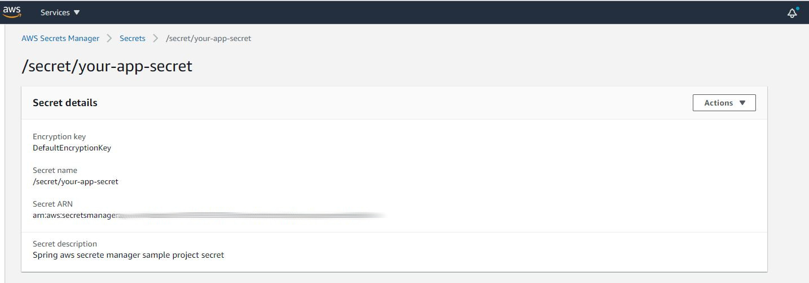

= Spring Cloud AWS Secret Manager Sample Application

This code sample demonstrates how to use the Spring Cloud AWS Secret Manager integration.
The sample demonstrates how one can access Secret Manager secrets through a `@ConfigurationProperties` class and also through `@Value` annotations on fields.

== Running the Sample

1. Create an AWS Cloud account if you don't have a one and start using the https://aws.amazon.com/secrets-manager/[Secrete Manager]. You can try AWS Secrets Manager at no additional charge with a https://aws.amazon.com/secrets-manager/pricing/[30-day free trial].

2. To store a new secrete:
  a. Go to 'AWS Secrete Manager' menu item from the AWS Console.
  b. Then go to secrets and Click 'Store a new secret'
  c. In the 'Store a new secret' screen, You will have the option to store different type of secrete such Credentilas for RDS database and Credentials for Redshift clusters.
  d. For this example, I chose 'Other types of secret option'

3. Authentication:
  a. If you are working in you local environment you need to have the aws keys in you computer.
  b. If your are going to deploy the application to a server, you need to have proper keys in the server.

4. Run the `$ mvn spring-boot:run` command from the same directory as this sample's `pom.xml` file.

6. Go to http://localhost:81/get/my-secrete in your browser.
Your secret value is injected into your application through the `SecreteManagerController` and you will see it displayed.
+
```
{
    "projectName": "Secret Manager Example",
    "projectId": "spring-aws-cloud"
}
```
+
Finally, you can view all of your secrets using AWS Console.


